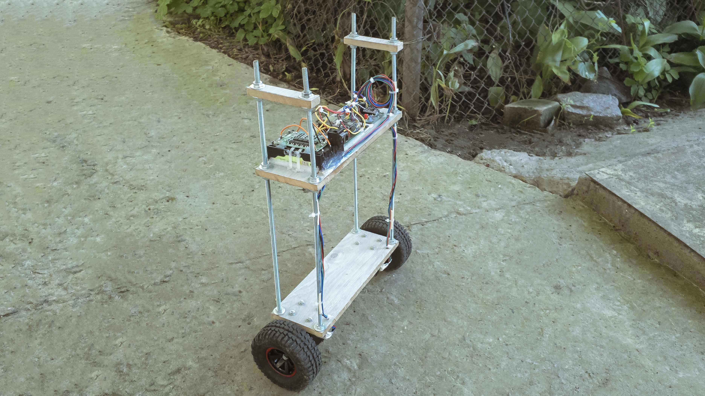
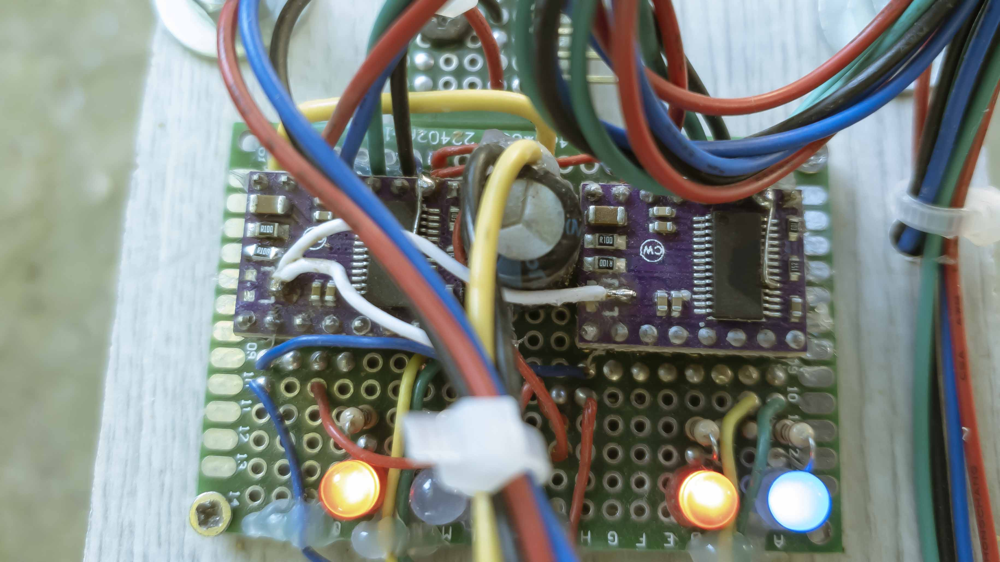
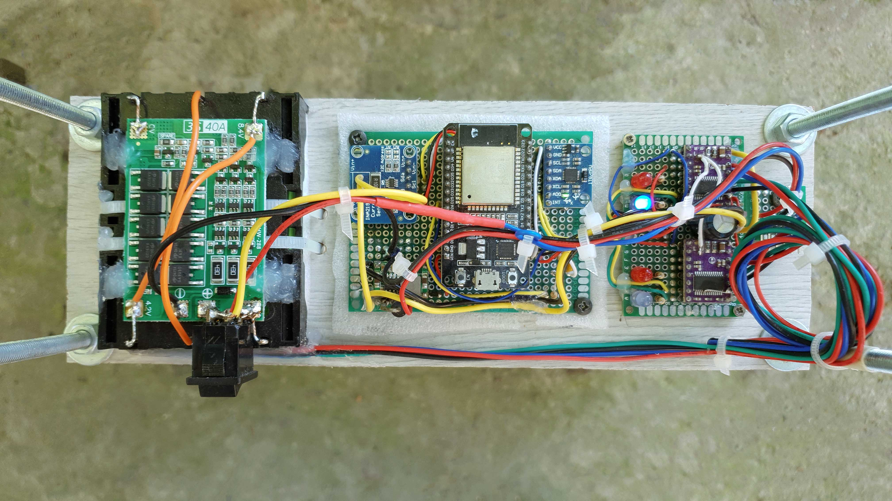

# This is ESP32 Based Balancing Robot


This is a fork of the "High speed balancing robot based on ESP32" created by Wouter Klop,
Original code is here:
https://gitlab.com/kloppertje/balancingrobot

The article that explains how this works is here:
http://elexperiment.nl/2018/11/high-speed-balancing-robot-introduction/

This modification contains several changes, one of them is a simple ability to change the direction of the motors individually:
```cpp
#define reverseLeftMotor true
#define reverseRightMotor false
```
Another change is the auto current control. It allows ESP32 to set current through the motors.
This feature requires you to remove trimmer potentiometer on the DRV8825 module and solder a wire (see the circuit & photo)


Yet another noticeable change is the use of two sets of PID values for "standing" and for "going", this allowed the robot to stay without any movement. (I was not able to achieve perfect standing without movement just with one set of PID values).

Set this to "0" for automatic switching (Experimental)

```cpp
uint8_t pidTypeApply = 1; // PID to use 0=auto, 1= go PIDs, 2= stay PIDs
```
Both PID value needs to be tuned separately which is "additional headache", so at first, it is the best just set it to "1" and use one set of PIDs.
(Not sure that I implemented this feature correctly, but I am satisfied with the results)

Also I added INA219 module to monitor current and voltage. Good for telemetry.
Also when the charger is connected it measures the capacity of the battery.
INA219 uses I2C bus just like MPU6050


There are many small tweaks also.

This is the final curcuit:


Most of the stuff for this robot I bought on Aliexpress

Motors: https://s.click.aliexpress.com/e/_d84I07S

Wheels: https://s.click.aliexpress.com/e/_dVBnisc (I bought wheels in a different seller but here is cheaper)

Battery: https://s.click.aliexpress.com/e/_d8cDFDa 3 battery is needed to get 12V

Battery Holder: https://www.aliexpress.com/item/32874365172.html

Protection Board: https://www.aliexpress.com/item/32852015245.html (3s 40a balanced)

DC-DC Converter: https://s.click.aliexpress.com/e/_dWvPhXW (it is different to the one I used, but seems to be better)

ESP32: https://s.click.aliexpress.com/e/_dTZisbE (3 port)

Hexagonal Coupling: https://s.click.aliexpress.com/e/_dZsbHNw (connects wheels to motors, 5mm)

Steppr Motor Bracket: https://s.click.aliexpress.com/e/_dW0qsAu

MPU6050 Gyroscope & Accelerometer Module: https://s.click.aliexpress.com/e/_d7tubEG

INA219 Voltage & Current sensor: https://s.click.aliexpress.com/e/_dXsJ7AG

PCB 4X6: https://s.click.aliexpress.com/e/_d65i2Sg

PCB 6X8: https://s.click.aliexpress.com/e/_d7XpQnS

I was using 1N5822 schottky diodes, just because I had them.

(some of the links are affiliate links)

I hope I did not forget anything :)

This project turned out to be a bit expensive, but I really wanted to make it. If you decided to build it I hope you know what you are doing, PID tuning is not easy... I'd say not for beginners, so good luck.
I think the robot would be better if it was lighter and a bit smaller, but this assumption needs to be tested.
Initially, I edited code in PlatformIO, but then I moved to Adruino IDE, for some reason OTA in Adruino IDE worked better, although I still get errors sometimes.


I must warn you that I am not a professional programmer, so there are probably much smarter ways to make all those changes. But all this worked for me, and I am happy with the results. The great thing about open source is that you can change the code the way you like it.
Thanks Wouter Klop for making this possible, check his video as well: https://www.youtube.com/watch?v=D7hvI_Tb0o4


